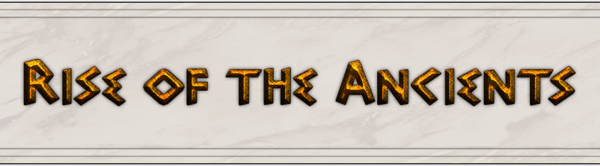
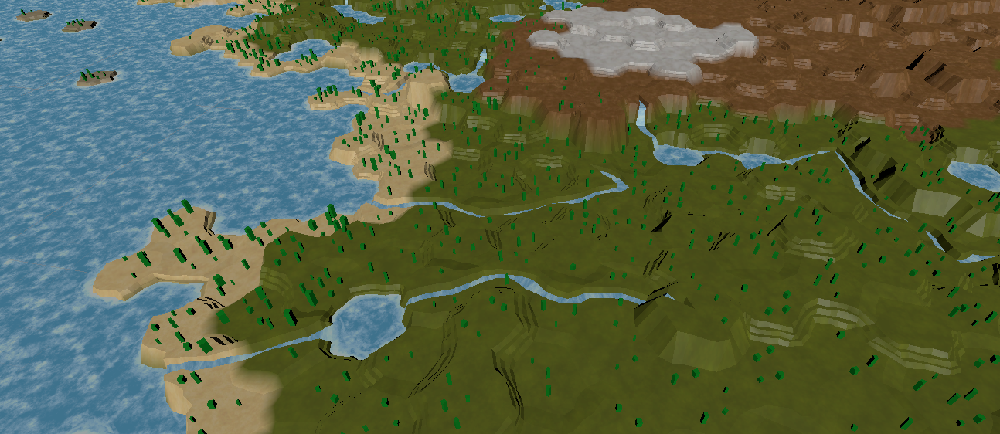

*Rise of the Ancients* (ROTA) is a 4X Grand Strategy game that combines the procedural map generation and sandbox philosophy of the *Civilization* series with the complex mechanics (economy, administration, events) of the *Europa Universalis* series of games. Its purpose is to allow players to delve into the intricacies of guiding a nation throughout its history in war, economic development and diplomacy while providing a new experience every time a new game is played through procedural world generation.

Here we showcase a snapshot of the current state of the project. If you don't have a lot of time to read then [jump straight into the feature demos](#feature-demos) or [learn how to run the game yourself](#running-the-game).


### Why another 4X game ?

The idea for ROTA came from our experience playing existing 4X games like *Civilization* and enjoying its procedural map generation which makes it so that every new game takes place and a new world which forces the player to adapt to new situations and brings with it the thrill of exploring a vast new setting. However, for a strategy lover *Civilization* leaves a lot to be desired. Its mechanics are very simple and they abstract the real world too much. In contrast *Europa Universalis* has been lauded by strategy gamers as the pinacle of 4X Grand Strategy. Set in the 15th century it allows players to take control of one of the existing states of the time and offers very complex and realistic mechanics which constantly challenge the players strategic thinking, presenting the player with complex decisions that affect the game in the long term. However *Europa Universalis* takes place in a fixed setting, the world in the 15th century, and despite its rich mechanics the setting can become dull very quickly while also eliminating the element of exploration since the game takes place on our world.

It became clear to us that a great opportunity was being wasted that could bring strategy game lovers to new delights. A game which offered players a rich and challenging strategic experience set in a different world every single time. Thus ROTA was born.


### About the Project

ROTA is a 3D game and is still in its prototype development stage, as we build the basic systems that will serve as its foundational elements using the Unity engine. Development of this prototype started in mid-summer 2020 and has advanced slowly since I am concurrently developing my final project for university. We plan to develop this prototype to serve as a foundation on which the game's design document will be built upon. As of now we have built the technology for a 3D world map, which has different Y levels unlike Civilization, and have started testing with units and pathfinding on the map as well as early inroads into procedural map generation. Alongside that we are laying the foundations for a 3D map editor to allow players to create hand made custom worlds.


### Running the game

This repository includes the full source code of the prototype alongisde the relevant Unity project files. If you want to run this game on a Linux machine you can run the x86-64 binary in the ```RiseOfTheAncients/Builds/Linux/``` directory. If you want to run this on a Windows or Apple machine you will have to open the Unity project yourself and build it. 

Do note that on running the game and reaching the main menu you should click the "Map Editor" option since this is the only active game mode.


### Feature demos

Disclaimer: As the team behind this is just two programmers and the project is still in the prototype development phase we have no artists on board (and we don't need them for now). That means all the art present in the project as of now is the famous *programmer art*. We are not artists and we don't pretend to be, we just do enough so that we can see something on screen. As such don't be hurt by simple geometric models, bad textures and awful UI sprites ... this isn't our job (we hope !). As such you will notice things such as simple green geometry representing trees or simple blue geometry representing player controlled units.

Disclaimer 2: Sorry for the lagginess of these demos, my poor old computer can barely handle screen recording software and the Unity editor running at the same time :(

#### 3D World Map, Procedural Map Generation and the Custom Map Editor
[Watch Demo](https://streamable.com/6h0jtq)

In this demo we begin by looking at the 3D World map. It is made of a programatically created mesh of hexagons. As you may notice in the demo they are irregular (this is done through Perlin noise) to make the landscape look more natural. After that we use the procedural map generator to automatically create a landscape and *voilá* it creates a world for us. There are various height levels so that the map can represent mountains and hills. There are also rivers and oceans animated using custom shaders. After looking at the beautiful map we reset it to a flat plain map and start using the custom editing tools that will in the future constitute the full-fledged map editor where we can change the ground from grass into desert, create mountains and hills, place rivers, forests (green basic geometry) and oceans. 

#### Pathfinding and Line of Sight
[Watch Demo](https://streamable.com/er3ccf) - The blue block of geometry represents the player controlled unit.

The game will allow the player to move units across the map to explore and attack other players (much like in the *Civilization* series of games). Pathfinding consists of the A* algorithm, implemented with the use of a custom priority queue class to make it as efficient as possible, achieving 1 millisecond search times in the worst case scenario even when running in the Unity editor (which is much slower than the built binary). You will also notice in the demo that the player can pause game time (stopping unit movement), this is so that the player can pause game action to think about his strategy.

Another concept related to this demo is Line of Sight. When the game starts the player does not know all of the map, just a little part of it. As he moves units around the map more of it is explored revealing the once hidden terrain. However even after exploring the terrain if a unit moves far away from it the terrain will become darker representing the fact that, although the player has explored that part of the map he can no longer see what is going on there, he has no vision of enemy units there if they are present. This is a standard part of all strategy games.


### About us

David Pereira and Renato Pereira are two software developers that have a passion for video games and their development. We have embarked on this project due to our vision for a different grand strategy game.


### Contact Information

Renato Pereira : renatofeghipereira5@gmail.com
David Pereira : heligolandpy@gmail.com


